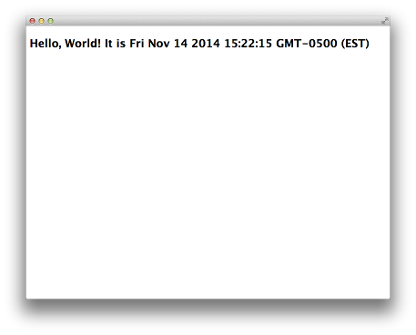

## workshop-cca-eh

Eh is a real-world messaging application, built with [Chrome Apps for Mobile](https://developer.chrome.com/apps/chrome_apps_on_mobile), that brings out the inner Canadian in all of us.

This repository contains the final version of Eh, plus a workshop to build it on your own. It incorporates a bit of [Polymer](https://www.polymer-project.org/) and some [Material Design](https://www.google.com/design/spec) elements, but mostly focuses on Chrome Apps APIs and development workflow.

### Background

[Chrome Apps](https://developer.chrome.com/apps/about_apps) are packaged, installable apps that run on desktop and are written using web technologies.  Chrome Apps have access to powerful [Chrome APIs](https://developer.chrome.com/apps/api_index), which are not available to traditional websites.

[Chrome Apps for Mobile](https://developer.chrome.com/apps/chrome_apps_on_mobile) is a project that allows these same Chrome Apps to run on mobile devices using Apache Cordova.  Many Chrome APIs are also [supported on mobile](https://github.com/MobileChromeApps/mobile-chrome-apps/blob/master/docs/APIsAndLibraries.md).

* Why does Chrome Apps for Mobile exist?

We want to prove that web-based mobile apps can be comparable to native apps, and that they deserve integration into the Play Store.  There's truth in some opinions against webview-based apps, but our goal is to show why, in some cases, they're actually the best approach.

### Prerequisites

Let's configure your development environment and run a sample app to make sure you can get started.

* First, clone this repository.

        git clone https://github.com/MobileChromeApps/workshop-cca-eh.git

* Connect your Android to the desktop via USB.
  * **Note:** Make sure you have [Developer Options and USB Debugging enabled](http://developer.android.com/tools/device.html#developer-device-options).

    > To access these settings, open the Developer options in the system Settings. On Android 4.2 and higher, the Developer options screen is hidden by default. To make it visible, go to **Settings > About phone** and tap **Build number** seven times. Return to the previous screen to find Developer options at the bottom.

#### Workflow

[`cca`](https://github.com/MobileChromeApps/mobile-chrome-apps) is our command line tool, used for creating, updating, and deploying apps.

* Install [`cca`](https://www.npmjs.org/package/cca) by following [this installation guide](https://github.com/MobileChromeApps/mobile-chrome-apps/blob/master/docs/Installation.md).

The [Chrome App Developer Tool for Mobile](https://github.com/MobileChromeApps/chrome-app-developer-tool) is an app that allows developers to iterate rapidly on apps in development.

* Install the [Chrome App Developer Tool](https://drive.google.com/uc?export=download&confirm=fjug&id=0B0UdPHoQPXheQjAwdmZfOENrQjQ) (CADT) on your Android Device.
  * **Note:** This is a custom-built version of CADT for this workshop.  It contains configuration for Google Cloud Messaging, which is used in the app we'll be creating.  If you already have a version of CADT installed, **please uninstall it before installing this one**.  (For future reference, the official release of CADT can be found [here](https://github.com/MobileChromeApps/chrome-app-developer-tool/releases)).

* Create a new project, importing the `app/` folder from this repo.

        cca create EhApp --copy-from ../PATH_TO/workshop-cca-eh/app/

* Run the app on your device.  Once you navigate to your app using `cd EhApp`, you have two options:
  1. Run `cca run android --device`.
  2. Open CADT on your device, and run `cca push --watch`.  This enables live deploy; your app will update whenever a file changes.

* On OS X, run `cca run chrome` to preview the app locally.

* If this works, you are good to go!

#### Totally Optional Steps for Hacking on UI

If you want to update Eh's custom elements and Polymer dependencies, you will need to install:

* [Bower](http://bower.io), and
* [Vulcanize](https://www.npmjs.org/package/vulcanize)

You can then run `ui/prepare.sh` to update the custom elements used to build the app's UI.  (This is required because of the [Content Security Policy](https://developer.chrome.com/extensions/contentSecurityPolicy), which disallows inline scripts inside Chrome Apps, an important part of Polymer.)

### Lets Get Started, Eh!

Now that you have your development environment set up, you can start building the Eh app on desktop or mobile.  This workshop will walk through each step to build it from scratch.

_**Continue to [Step 1: Getting Started &raquo;](https://github.com/MobileChromeApps/workshop-cca-eh/blob/master/docs/step1.md)**_
